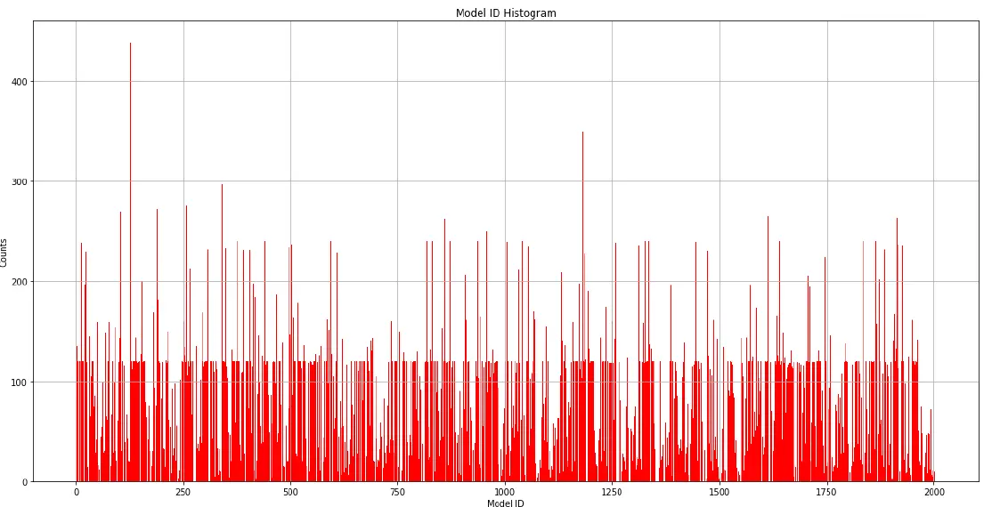

# CarMake

It is one of the [NTU](https://www.ntu.edu.sg/)'s CZ4042 Neural Networks and Deep Learning Module Project

## What?

We are tasks to come up with a potential technique for the application or mitigate the issue that is related to neural networks and deep learning.

## Why?

To apply neural networks and deep learning techniques base on what we have learnt from this module.

## How?

1. Analysis datasets structure and complexity
2. Setup the necessary procure hardware neural-centric processor required to train the model
3. Preprocess and normalised datasets
4. Train the exist or new model
5. Optimisation techniques for the given dataset if necessary
6. Repeat the training exist or new model
7. Compare results and provide necessary remarks
8. Conclusion of the results
9. Automatised it if need to

## Highlights

## Disclaimer

All external data and assets in this project used is intended for educational purpose only.

## Contributor

CarMake Team
